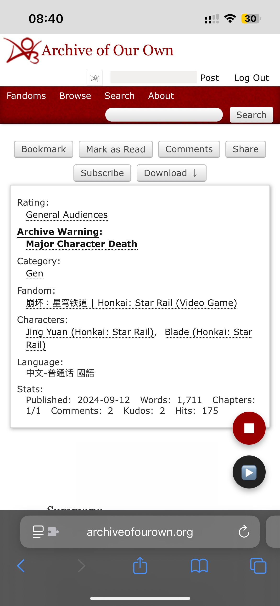

# ReadingMarker

一個為 iPhone Safari 寫的閱讀進度標記腳本。

主要用來解決在手機上看長篇小說 (如 AO3 或 FC2 部落格) 時，因為不小心重整網頁或切換 App 導致畫面跳回最頂端、找不到上次讀到哪的痛點。 

---

## 功能特點

- **AO3 支援**：精準鎖定每篇作品的 `works ID`。
- **FC2 支援**：自動相容不同的子網域。
- **狀態提示**：
  - 🔴 **■ 按鈕**：點擊記錄當前滾動位置。
  - ⚪/⚫ **▶ 按鈕**：如果該文章本地有舊記錄，按鈕會自動變黑（點亮）；若無記錄則呈現半透明灰色。

---

## 安裝

1. 手機確保已安裝並開啟 [Stay for Safari](https://apps.apple.com/tw/app/stay-for-safari-%E4%BD%BF%E7%94%A8%E8%80%85%E8%85%B3%E6%9C%AC%E8%88%87%E5%BB%A3%E5%91%8A%E6%94%94%E6%88%AA%E6%93%B4%E5%85%85/id1591620171)
2. 開啟 Stay App，點擊右上角 **「+」**，選擇 **通過鏈接導入**
3. 複製並貼上下方網址：
   ```
    https://raw.githubusercontent.com/rye1014/ReadingMarker/main/reading-marker.user.js
   ```
4. 進入 iPhone 設定 -> Safari -> 延伸功能，確保已將 Stay 啟用

--- 

## 使用

1. 進入小說頁面，按右下角 **■** 即可標記位置。
2. 再次進入同網頁時，按下 **▶**就會滾動會上次標記處。

### 畫面預覽
   